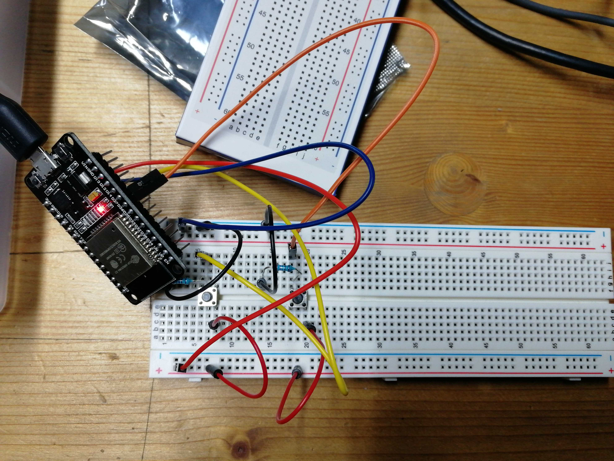

# dashbouton
Dans ce projet nous allons creer un dashbouton capable de rajouter ou d'enlever un produit dans un compteur.
## liste des composant

+ un arduino esp3221
+ deux boutons pushboutton
+ 1 breadboard
+ deux resistance 220oms
+ des cables male/femelle

## Image du montage



## Tu vas avoir besoin de !!
+ 1 pc sous UBUNTU 18 
+ l'appli mosca installeé (serveur mqtt)
+ l'appli node-red installé (serveur node red pour l'interface)

## C parti

ouvre un terminal et verifie ton ip 
```
ip addr
```

